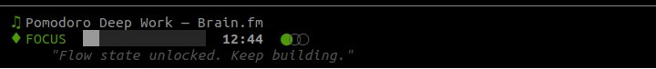

# focusline

AI-powered focus music plugin for coding CLIs. Say "play music" and it plays neuroscience-backed focus music with an automatic Pomodoro timer -- right inside Claude Code, Cursor, Windsurf, or any MCP-compatible editor.

Built for the **GMI Cloud x GLM Hackathon**.

## Screenshot



## How It Works

```
You: "play some music"

  1. GLM DJ picks optimal Pomodoro timer (25/5, 50/10, or 15/3 based on time of day)
  2. GLM DJ picks music source (Brain.fm, YouTube, Lyria 3, or procedural)
  3. Music plays and loops continuously
  4. Status bar shows track + Pomodoro countdown
  5. Auto-switches between focus music and break music
  6. GLM generates rotating motivational quotes
```

## The Science

Based on [brain.fm research](https://doi.org/10.1038/s42003-024-07026-3) (Nature, 2024, N=677):

- **Neural entrainment** -- brain synchronizes with rhythmic audio at beta frequencies (16Hz) for focus
- **Low salience music** -- no vocals, no sudden changes, repetitive patterns fade into background
- **Pomodoro integration** -- 25-min sessions align with attention span research; 4 cycles fit ultradian rhythm (90-120 min)
- **Circadian adaptation** -- GLM adjusts timer presets based on time of day (deep work in morning, sprints after lunch)

## Features

- **GLM 5.1 AI DJ** -- picks music source, timer settings, and generates motivational quotes via GMI Cloud
- **Brain.fm tracks** -- curated 30-min neuroscience-backed focus tracks from brain.fm's YouTube channel
- **Google Lyria 3** -- AI-generated music clips for variety between tracks
- **YouTube** -- search and play any instrumental focus music
- **Procedural audio** -- instant binaural beats (16Hz focus), pink noise, rain, drones
- **Pomodoro timer** -- auto-picks preset (Classic 25/5, Deep Work 50/10, Sprint 15/3)
- **Status line** -- live track display + Pomodoro countdown + motivational quotes in Claude Code
- **Track naming** -- GLM generates creative names for AI-generated tracks
- **Auto-rotation** -- swaps tracks every 3 minutes during focus sessions for variety

## Architecture

```
┌──────────────────┐       stdio        ┌──────────────────────────────────┐
│ Coding CLI       │◄─────────────────►│  MCP Server                      │
│                  │                    │                                   │
│ Claude Code      │  "play music"     │  ┌──────────┐   ┌──────────────┐ │
│ Cursor           │ ─────────────────►│  │ GLM 5.1  │──►│ Music Source  │ │
│ Windsurf         │                   │  │ DJ Agent │   │              │ │
│ Cline            │  status bar       │  └──────────┘   │ - Brain.fm   │ │
│                  │◄─ state.json ───  │       │         │ - YouTube    │ │
│ ▶ Kyoto [brainfm]│                   │  ┌────▼─────┐   │ - Lyria 3    │ │
│ 🎯 FOCUS 18:46   │                   │  │ Pomodoro │   │ - Procedural │ │
│ "Build..."       │                   │  │ Timer    │   │ - Freesound  │ │
│                  │                   │  └──────────┘   └──────────────┘ │
│                  │                   │       │                           │
│        🔊        │◄── ffplay ────────│  ┌────▼─────┐                    │
│                  │                   │  │ Player   │                    │
└──────────────────┘                   │  └──────────┘                    │
                                       └──────────────────────────────────┘
```

## Project Structure

```
├── src/                        # Main package
│   ├── server.py               # MCP server (13 tools, state poller, Pomodoro engine)
│   ├── dj_agent.py             # GLM 5.1 AI DJ (source selection, quotes, neuroscience prompt)
│   ├── player.py               # Cross-platform audio playback (ffplay)
│   ├── state.py                # Shared state file (atomic writes for status line)
│   ├── statusline.py           # Claude Code status bar renderer
│   ├── tui.py                  # Terminal widget (standalone mode)
│   └── sources/                # Music sources
│       ├── brainfm.py          # Curated Brain.fm YouTube tracks
│       ├── lyria.py            # Google Lyria 3 AI music + GLM track naming
│       ├── youtube.py          # YouTube search/download via yt-dlp
│       ├── procedural.py       # Binaural beats, pink noise, rain, drone
│       ├── minimax_music.py    # MiniMax Music 2.5 via GMI Cloud
│       ├── freesound.py        # Freesound.org ambient sounds
│       └── local_cache.py      # Local audio file scanner
├── scripts/
│   ├── generate_music.py       # Standalone Lyria 3 music generator
│   └── test-keys.sh            # GMI Cloud API key validator
├── docs/                       # Research & reference docs
│   ├── focus-music-guide.md    # Neuroscience guide for focus music generation
│   ├── gmi-cloud-services.md   # GMI Cloud full service catalog
│   ├── gmi-inference-models.md # 45 LLM + 238 media models
│   └── ...
├── pyproject.toml
├── .env.example
└── opencode.json               # OpenCode config (45 GMI models)
```

## Install

```bash
git clone https://github.com/tantk/productivity-music-mcp.git
cd productivity-music-mcp
pip install -e .
```

## API Keys

```bash
cp .env.example .env
```

Required (at least one):
- `GMI_INFER` -- GMI Cloud inference key ([get one](https://console.gmicloud.ai/user-setting/api-keys)) -- powers the GLM DJ agent
- `GOOGLE_API` -- Google AI key -- powers Lyria 3 music generation

Optional:
- `FREESOUND_API_KEY` -- [free key](https://freesound.org/apiv2/apply/) for nature sounds

## Setup

### Claude Code

```bash
claude mcp add productivity-music -- productivity-music-mcp
```

The status line installs automatically. Or add manually to `~/.claude/settings.json`:
```json
{
  "statusLine": {
    "type": "command",
    "command": "productivity-music-status",
    "refreshInterval": 2
  }
}
```

### Cursor / Windsurf / Cline / Any MCP Client

```json
{
  "mcpServers": {
    "productivity-music": {
      "command": "productivity-music-mcp",
      "env": {
        "GMI_INFER": "your-key",
        "GOOGLE_API": "your-key"
      }
    }
  }
}
```

## Usage

Just talk to your AI assistant:

```
"Play some music"              -> Brain.fm focus track + Pomodoro timer
"Play something calm"          -> Nature sounds or ambient music
"I need energy"                -> Upbeat instrumental
"Stop the music"               -> Stops everything
```

The GLM DJ automatically:
- Picks the right music source (Brain.fm for focus, YouTube for variety, procedural for instant)
- Sets the Pomodoro timer based on time of day
- Names AI-generated tracks creatively
- Rotates motivational quotes every 60 seconds
- Swaps tracks every 3 minutes for variety

### Standalone TUI

```bash
productivity-music                    # Interactive preset menu
productivity-music --preset 1        # Classic Pomodoro (25/5 x 4)
productivity-music --preset 2        # Deep Work (50/10 x 3)
productivity-music --mode focus      # Music only, no timer
```

## Available MCP Tools

| Tool | Description |
|---|---|
| `music(request)` | Start music + Pomodoro (default, recommended) |
| `stop()` | Stop everything |
| `now_playing()` | Check what's playing |
| `recommend_session()` | Get AI-recommended Pomodoro preset |
| `generate_lyria(mood)` | Generate AI music (focus/calm/energize/break/sleep) |
| `generate_procedural(type, duration)` | Instant sounds (binaural_beats/pink_noise/rain/drone) |
| `play_youtube(query)` | Search and play from YouTube |
| `play_freesound(query)` | Search nature sounds |
| `play_audio(path, loop)` | Play a local file |
| `list_tracks()` | List cached audio |
| `list_sources()` | Show available sources |
| `pomodoro(focus, break, cycles)` | Manual Pomodoro with custom timing |

## Tech Stack

- **GLM 5.1** via GMI Cloud -- AI DJ agent, track naming, motivational quotes
- **DeepSeek V3.2** via GMI Cloud -- fallback LLM for DJ decisions
- **Google Lyria 3** -- AI music generation (30s clips)
- **Brain.fm** -- curated neuroscience-backed focus tracks (via YouTube)
- **MCP SDK** -- Model Context Protocol for CLI integration
- **ffplay** -- cross-platform audio playback
- **yt-dlp** -- YouTube audio download
- **Rich** -- terminal UI rendering

## Requirements

- Python 3.10+
- `ffplay` (from ffmpeg) for audio playback
- `yt-dlp` for YouTube (optional, `pip install yt-dlp`)
- At least one API key (GMI_INFER or GOOGLE_API)

## Future updates

- Integration with own Spotify playist via Oauth
  
## License

MIT
